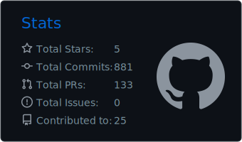
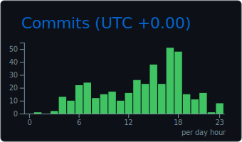

# Hii, I'm Chandrima!

  

 

-💻 I love contributing to open-source projects and collaborating with the community to solve real-world problems.

-🔥 Passionate about learning new technologies, and gaining knowledge.

-🐧 Currently exploring Linux.

-📫 How to reach me **hazrachandrima6@gmail.com**

 
 

## Technologies I've worked with

### Languages
  
      
    
  ### Libraries & Frameworks
  

    
  ### Databases
  

   ### Cloud Services
  
   
    
  ### Software Tools
  

 ### DevOps & Containerization

### Operating Systems/ Kernels

 

## My GitHub stats

  
<!--   
   -->
  
  

 

 

  
   
  that's just me the entire day

 

  
### Connect with me
  

<!-- ### My contributions in Hacktoberfest 2024
 

   

 -->

