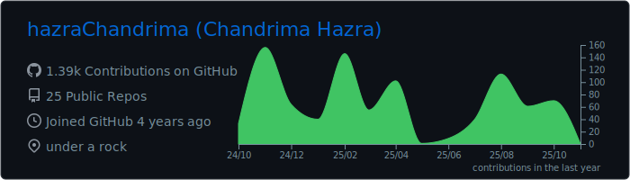
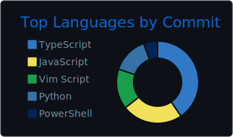

# Hii, I'm Chandrima!

  

 

-💻 I love contributing to open-source projects and collaborating with the community to solve real-world problems.

-🔥 Passionate about learning new technologies, and gaining knowledge.

-🐧 Currently exploring Linux.

 
 

## Technologies I've worked with

### Languages
  
      
    
  ### Libraries and Frameworks
  

    
  ### Databases
  
   
    
  ### Software Tools
  
 

### Operating Systems/ Kernels

 

## My GitHub stats

  
<!--   
   -->
  
  

 

 

  
   
  that's just me the entire day

<!-- ### My contributions in Hacktoberfest 2024
 

   

 -->
